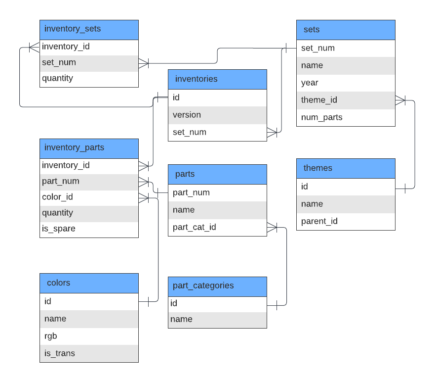

# Lego Freak's Wet Dream: An Interview at Denmark's Jewel

I’m a Lego freak. This goes back as far as I can remember. My mom would tell me that I would sit with the Lego sets, following instructions, in complete silence, for hours on end. No food, no bathroom break, no reaction to questions. I remember the feeling of being entirely engrossed in the process, tunnel-zoned in on building. In fact, I believe that it is the last time I felt a true flow without even knowing it.

Fig. 1: Me building Lego in Oct 1994.

So I recently applied to work as a data analyst intern at the famous Lego Group in Denmark. As part of the job interview process, I received the following take-home assignment:

You are asked to use the provided dataset and database schema to understand the popularity of different Lego sets and themes. The idea is to become familiarized with the data to be ready for an interview with a business stakeholder.

## Data

#### inventory_parts

"inventory_id" - id of the inventory the part is in (as in the inventories table)
"part_num" - unique id for the part (as in the parts table)
"color_id" - id of the color
"quantity" - the number of copies of the part included in the set
"is_spare" - whether or not it is a spare part

#### parts

"part_num" - unique id for the part (as in the inventory_parts table)
"name" - name of the part
"part_cat_id" - part category id (as in part_catagories table)

#### part_categories

"id" - part category id (as in parts table)
"name" - name of the category the part belongs to

#### colors

"id" - id of the color (as in inventory_parts table)
"name" - color name
"rgb" - rgb code of the color
"is_trans" - whether or not the part is transparent/translucent

#### inventories

"id" - id of the inventory the part is in (as in the inventory_sets and inventory_parts tables)
"version" - version number
"set_num" - set number (as in sets table)

#### inventory_sets

"inventory_id" - id of the inventory the part is in (as in the inventories table)
"set_num" - set number (as in sets table)
"quantity" - the quantity of sets included

#### sets

"set_num" - unique set id (as in inventory_sets and inventories tables)
"name" - the name of the set
"year" - the year the set was published
"theme_id" - the id of the theme the set belongs to (as in themes table)
num-parts - the number of parts in the set

#### themes

"id" - the id of the theme (as in the sets table)
"name" - the name of the theme
"parent_id" - the id of the larger theme, if there is one

Acknowledgments: Rebrickable.com

## Database Structure

Fig. 2: Database Structure
